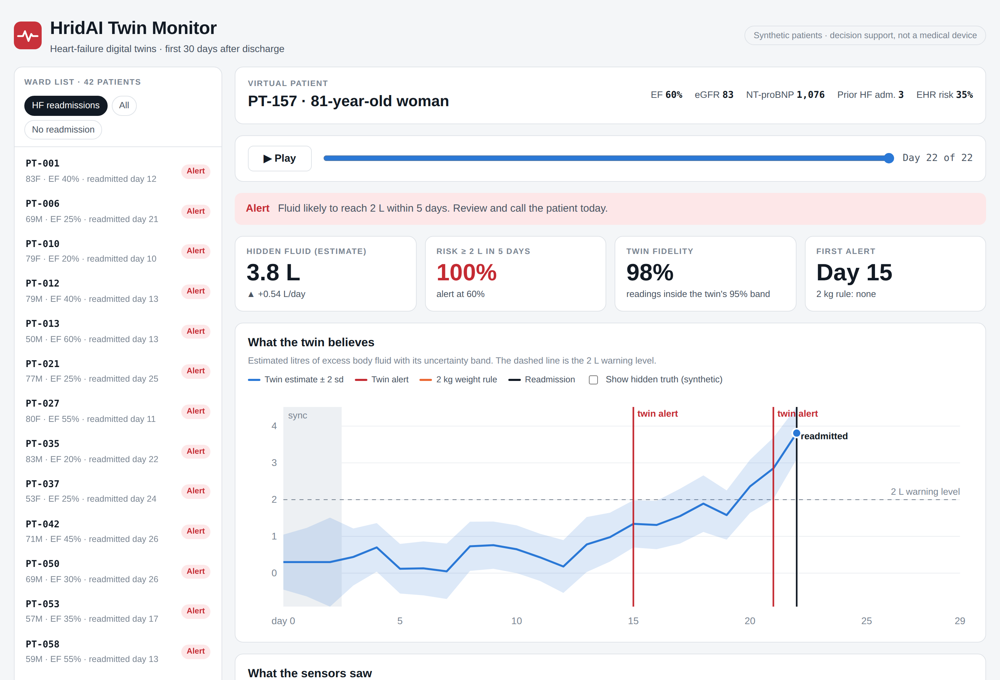
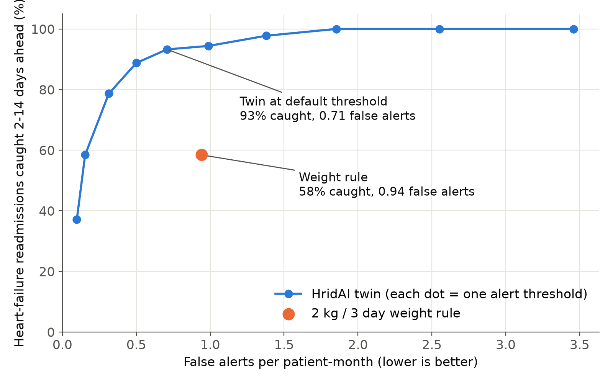
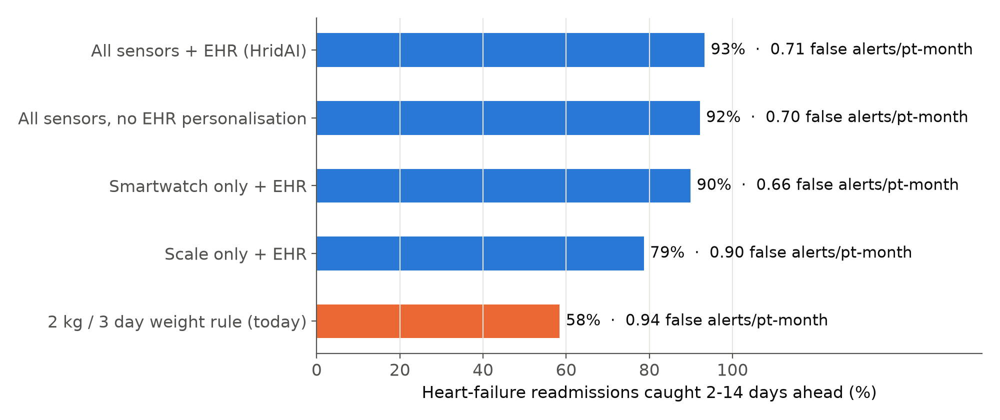
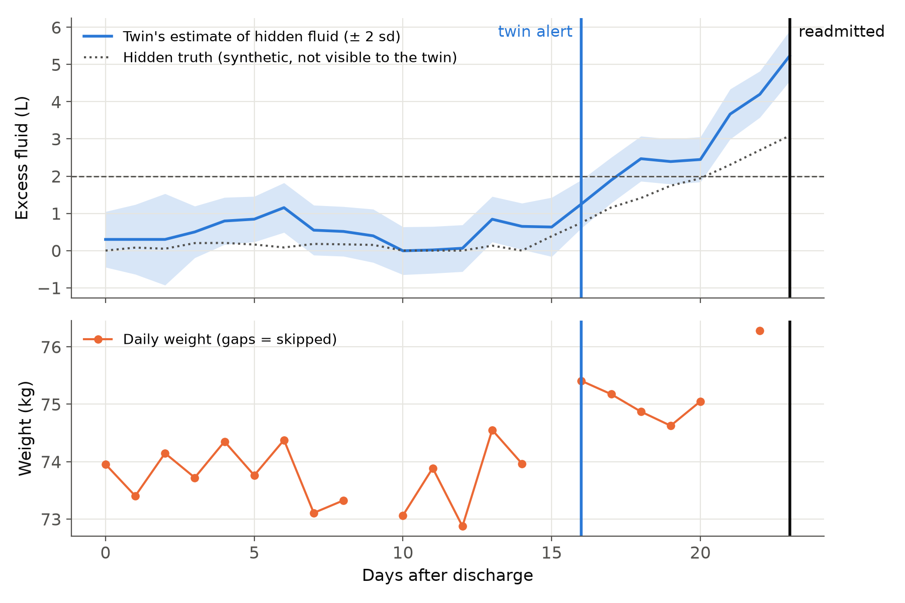

# HridAI: a digital twin that sees heart failure coming

> **Happiest Health Digital Twin Challenge 2026** · Team **Octas** · XLRI Jamshedpur
>
> *Hriday* (हृदय) means heart. HridAI is a virtual replica of a heart-failure patient that watches them through the 30 days after hospital discharge and warns their doctor days before they would be readmitted.

### ▶ [Open the live dashboard](https://claude.ai/artifact/NUTA8SNFtbnV7SRMqw45AQ)

Runs in any web browser, no install. The same dashboard ships in this repository as [`dashboard/index.html`](dashboard/index.html); download it and double-click to open it offline.

[](https://claude.ai/artifact/NUTA8SNFtbnV7SRMqw45AQ)

## Submission checklist

| Required item | Where to find it |
|---|---|
| Team details | [Team](#team-details) |
| College / incubator information | [Team](#team-details) |
| Project title | **HridAI: a digital twin that sees heart failure coming** |
| Problem statement | [Problem statement](#problem-statement) |
| Healthcare use case | [Healthcare use case](#healthcare-use-case) |
| Technical stack | [Technical stack](#technical-stack) |
| AI/ML model or framework details | [AI/ML model](#aiml-model) |
| Demo video (unlisted YouTube) | [Demo video](#demo-video) |
| Open-source licence | [Licence](#open-source-licence) (MIT) |
| Architecture diagram (PDF) | [docs/architecture.pdf](docs/architecture.pdf) |
| Presentation (PDF/PPT) with project details and outcomes | [docs/presentation.pdf](docs/presentation.pdf) · [docs/presentation.pptx](docs/presentation.pptx) |
| Live dashboard | [Open in browser](https://claude.ai/artifact/NUTA8SNFtbnV7SRMqw45AQ) · [dashboard/index.html](dashboard/index.html) |
| All files and links publicly accessible | Yes. This repository is public, the video is unlisted (viewable by anyone with the link), and every document is inside the repository. |

## Team details

| | |
|---|---|
| Team name | Octas |
| Team size | 1 (solo entry) |
| Team leader | Aditya Jain |
| Programme | PGDM (Business Management), batch 2026–28 |
| College | XLRI – Xavier School of Management, Jamshedpur, Jharkhand, India |
| Incubator | Not applicable |
| Contact | b26116@astra.xlri.ac.in |

## Problem statement

Heart failure is a chronic cardiovascular condition with a heavy burden in India. In the Trivandrum Heart Failure Registry (Kerala), patients were about a decade younger than in Western registries and roughly one in three died within a year of their admission. The most dangerous period is the month after a heart-failure discharge: fluid silently re-accumulates over about a week before the patient becomes breathless, and by then readmission is usually unavoidable.

The tool patients get at home today is a single rule: *call your doctor if your weight rises by more than 2 kg in 3 days*. It relies on one noisy daily reading that elderly patients often skip. Meanwhile, the smartwatch many patients already own records night heart rate, HRV, breathing rate, SpO2, sleep and activity, all of which shift as fluid builds up. Nobody reads those signals together, against the patient's own baseline and discharge record.

**Goal of this proof-of-concept:** fuse a patient's static health record (EHR) with dynamic wearable and scale data into a per-patient digital twin that predicts a heart-failure readmission (the adverse event) days in advance, and gives the doctor a dashboard to act on it.

## Healthcare use case

1. **Day 0, discharge.** The cardiology team enrols the patient. The discharge record (ejection fraction, kidney function, NT-proBNP, sodium, diuretic dose, prior admissions, genetic risk) initialises the twin. The patient goes home with a smartwatch and a Bluetooth scale.
2. **Days 0–2, sync.** The twin learns the patient's own normal for every signal.
3. **Every night.** The twin updates its estimate of hidden excess fluid, forecasts 5 days ahead, scores its own accuracy (twin fidelity), and asks the family for a weigh-in when it is uncertain and the trend is rising.
4. **Alert.** When the 5-day risk crosses the threshold, the clinician sees an alert on the dashboard, tries a treatment change on the twin (what-if), and calls the patient. The family receives a plain-language message in Hindi or English.

**Users:** heart-failure clinics, cardiac rehabilitation programmes, hospital-at-home teams, insurers' care-management teams. **Patients:** adults (often elderly) recovering at home after a heart-failure admission.

## How it works

| Step | What the twin does |
|---|---|
| 1. Sync | Days 0–2 at home set personal baselines for all seven signals. |
| 2. EHR personalisation | Ejection fraction sets how strongly heart rate responds to fluid; an EHR risk score (EF, eGFR, NT-proBNP, sodium, prior admissions, polygenic risk) sets how readily the twin believes a rising trend. |
| 3. State estimation | A Kalman filter tracks the hidden state [excess fluid (L), daily trend (L/day)] with uncertainty, fusing whichever sensors reported that night. Missing days simply widen the uncertainty. |
| 4. Forecast | Probability that fluid reaches 2 L within 5 days, computed in closed form. Alert at ≥ 60%. |
| 5. Twin fidelity | Before each update the twin predicts tonight's readings; fidelity is the share that land inside its own 95% prediction band. |
| 6. Active sensing | Uncertain + rising + scale skipped → ask the family for a weigh-in. |
| 7. What-if | Projects fluid 10 days ahead under a clinician-chosen diuretic change. Decision support only. |

## Results

Untouched **test cohort of 500 synthetic patients** (seed 11): 89 heart-failure readmissions and 29 other-cause readmissions within 30 days. The alert threshold (0.6) was chosen on a separate development cohort (seed 7). A readmission counts as caught if an alert fired 2–14 days before it, enough time to act.

| Method | HF readmissions caught 2–14 days ahead | Median warning | False alerts per patient-month |
|---|---|---|---|
| **HridAI twin** | **93%** | 4 days | **0.71** |
| 2 kg / 3 day weight rule (current guidance) | 58% | 4.5 days | 0.94 |



**Ablation: what each data stream contributes**

| Variant | Caught | False alerts / patient-month |
|---|---|---|
| All sensors + EHR (HridAI) | 93% | 0.71 |
| All sensors, no EHR personalisation | 92% | 0.70 |
| Smartwatch only + EHR | 90% | 0.66 |
| Scale only + EHR | 79% | 0.90 |
| 2 kg / 3 day weight rule | 58% | 0.94 |





Every number and chart above is reproduced by `python make_figures.py` (results also saved to `docs/results.json`).

## Technical stack

| Layer | Tools |
|---|---|
| Language | Python 3.10+ |
| Twin, simulation and evaluation | NumPy, pandas |
| Clinician dashboard | Browser dashboard (HTML, CSS, JavaScript, SVG; no dependencies) and a Streamlit + Plotly app |
| Figures | Matplotlib |
| Tests | pytest (11 tests, including a no-look-ahead-leakage test) |
| Documents | PowerPoint presentation; architecture diagram from `docs/source/architecture.html` |

## AI/ML model

- **Type:** linear-Gaussian state-space model (Kalman filter), one per patient, a probabilistic model rather than a trained black box.
- **State:** x = [excess fluid (litres), daily trend (litres/day)], constant-trend dynamics F = [[1, 1], [0, 1]] with process noise Q.
- **Observations:** seven signals z = personal baseline + H·x + noise, where H holds each sensor's response to one litre of fluid. H is personalised from the EHR (heart-rate response depends on ejection fraction), and Q's trend term scales with an EHR risk score.
- **Prediction:** 5-day-ahead Gaussian forecast; risk = P(fluid ≥ 2 L), alert at ≥ 0.6.
- **Self-verification:** twin fidelity from one-step-ahead innovations; uncertainty-triggered data requests (active sensing).
- **Why this model:** works with ~30 days of data per patient, needs no large training set, handles missing data natively, gives calibrated uncertainty, and every alert can be traced to the signals that moved.
- **Baseline:** the guideline 2 kg / 3 day weight-gain rule.
- **Validation design:** development and test cohorts from different random seeds; causal (day *t* uses only data up to day *t*, enforced by a test).

## Data

All data is **synthetic**, as the challenge sandbox rules require; no real patient data is used or stored. `twin.py` generates:

- **EHR (static):** age, sex, ejection fraction, eGFR, NT-proBNP, sodium, diabetes, hypertension, furosemide dose, prior heart-failure admissions, and a synthetic polygenic risk percentile (genetic marker).
- **Wearables (dynamic, nightly):** night heart rate, HRV (RMSSD), breathing rate, SpO2, sleep efficiency, steps.
- **Smart scale (dynamic, daily):** morning weight.

To keep the test honest, each synthetic patient's sensors respond differently from the twin's assumptions; some patients decompensate fast (little warning); salty-meal fluid bumps resolve on their own; scales have offsets; 25% of weigh-ins and 10% of watch nights are missing; and some readmissions are for unrelated causes the twin should not claim.

## Repository structure

```
Octas_XLRI-Jamshedpur/
├── README.md                   this file (all submission items)
├── LICENSE                     MIT
├── requirements.txt
├── twin.py                     synthetic cohort, the twin, evaluation
├── app.py                      Streamlit clinician dashboard
├── make_figures.py             reproduces every result and chart
├── dashboard/
│   ├── index.html              live browser dashboard (self-contained, opens offline)
│   ├── template.html           dashboard layout and logic
│   └── build_dashboard.py      runs the twin and embeds results into index.html
├── tests/test_twin.py          11 tests
└── docs/
    ├── architecture.pdf        architecture diagram
    ├── presentation.pdf        presentation (16 slides)
    ├── presentation.pptx       presentation, editable PowerPoint
    ├── results.json            numbers behind the README and slides
    ├── figures/                charts and dashboard screenshots
    └── source/architecture.html  editable source of the architecture diagram
```

## Run it

```bash
pip install -r requirements.txt
python twin.py           # print test-cohort results and ablation (~30 s)
python make_figures.py   # regenerate charts and docs/results.json
pytest                   # run the tests
python dashboard/build_dashboard.py   # rebuild the browser dashboard
streamlit run app.py     # open the Streamlit dashboard at http://localhost:8501
```

## Demo video

▶ **[Watch the demo video on YouTube](https://youtu.be/VIDEO_ID)**

The video (about 20 minutes) walks through the problem, the model, a live dashboard demo and the results.

## Limitations

- Results come from synthetic data generated by a model related to the twin's own, so they are optimistic. Real-world accuracy needs clinical validation.
- Sensor responses to fluid are literature-informed assumptions, not fitted to Indian patients.
- The what-if panel is illustrative, not a pharmacological model.
- HridAI is a research prototype and decision-support concept, **not a medical device**. It never changes treatment on its own.

## References

- Stehlik J, et al. *Continuous Wearable Monitoring Analytics Predict Heart Failure Hospitalization: The LINK-HF Multicenter Study.* Circ Heart Fail. 2020. https://www.ahajournals.org/doi/10.1161/CIRCHEARTFAILURE.119.006513
- Harikrishnan S, et al. *One-year mortality outcomes and hospital readmissions of patients admitted with acute heart failure: Trivandrum Heart Failure Registry.* Am Heart J. 2017. https://pubmed.ncbi.nlm.nih.gov/28625377/
- Synthea synthetic patient generator: https://synthetichealth.github.io/synthea/

## Open-source licence

Released under the **MIT License**. See [LICENSE](LICENSE). Copyright (c) 2026 Team Octas (Aditya Jain).
